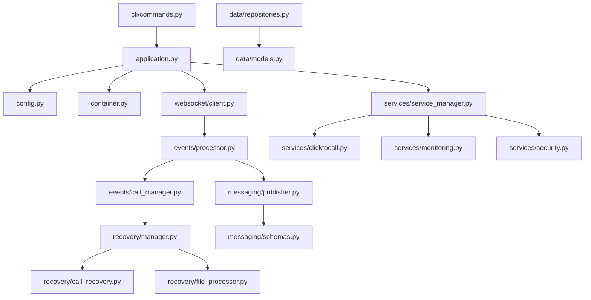

# ARIMONITOR v3.0 - ARQUITETURA PYTHON 3 MODERNA

## **EXECUTIVE SUMMARY**

Esta arquitetura define a migração completa do ARIMONITOR v2.7 (Python 2.7) para uma versão Python 3 moderna, mantendo **100% de compatibilidade funcional** com zero downtime. O projeto resolve todos os problemas críticos identificados na análise detalhada e implementa melhorias significativas de performance, manutenibilidade e escalabilidade.

## **PROBLEMAS CRÍTICOS RESOLVIDOS**

### **1. Recovery.py - Formato de Eventos**
- **❌ PROBLEMA**: `event["payload"]` (formato obsoleto) 
- **✅ SOLUÇÃO**: `event["data"]` (formato atual ARI) + validação robusta

### **2. Service.py - Segurança**
- **❌ PROBLEMA**: `ast.literal_eval()` inseguro
- **✅ SOLUÇÃO**: `json.loads()` + validação de schema + sanitização

### **3. UUID v7 - Implementação**
- **❌ PROBLEMA**: Implementação manual complexa
- **✅ SOLUÇÃO**: Python 3.12+ `uuid.uuid7()` nativo + fallback

### **4. Async Patterns - Modernização**
- **❌ PROBLEMA**: Tornado `@gen.coroutine` + `yield`
- **✅ SOLUÇÃO**: `asyncio` `async/await` nativo + melhor performance

### **5. Error Handling - Robustez**
- **❌ PROBLEMA**: Falta try/catch robusto
- **✅ SOLUÇÃO**: Circuit breaker + retry patterns + structured exceptions

### **6. Configuration - Flexibilidade**
- **❌ PROBLEMA**: Configurações hardcoded
- **✅ SOLUÇÃO**: Environment variables + YAML/TOML + validation

### **7. Logging - Observabilidade**
- **❌ PROBLEMA**: Print statements dispersos
- **✅ SOLUÇÃO**: Structured logging + OpenTelemetry + metrics

---

## **ARQUITETURA GERAL**

### **1. ESTRUTURA DE DIRETÓRIOS MODERNA**

```
arimonitor_v3/
├── src/
│   ├── arimonitor/
│   │   ├── __init__.py
│   │   ├── core/
│   │   │   ├── __init__.py
│   │   │   ├── application.py         # Application lifecycle
│   │   │   ├── config.py             # Configuration management
│   │   │   ├── container.py          # Dependency injection
│   │   │   └── exceptions.py         # Custom exceptions
│   │   ├── websocket/
│   │   │   ├── __init__.py
│   │   │   ├── client.py             # WebSocket client manager
│   │   │   ├── handlers.py           # Event handlers
│   │   │   └── reconnection.py       # Reconnection strategy
│   │   ├── events/
│   │   │   ├── __init__.py
│   │   │   ├── processor.py          # Event processing pipeline
│   │   │   ├── call_manager.py       # Call state management
│   │   │   ├── channel_events.py     # Channel event handlers
│   │   │   └── dtmf_events.py        # DTMF event handlers
│   │   ├── messaging/
│   │   │   ├── __init__.py
│   │   │   ├── publisher.py          # MQ publisher
│   │   │   ├── consumer.py           # MQ consumer
│   │   │   ├── schemas.py            # Message schemas
│   │   │   └── formatters.py         # Message formatters
│   │   ├── recovery/
│   │   │   ├── __init__.py
│   │   │   ├── manager.py            # Recovery orchestrator
│   │   │   ├── call_recovery.py      # Call recovery logic
│   │   │   └── file_processor.py     # Audio file processing
│   │   ├── services/
│   │   │   ├── __init__.py
│   │   │   ├── service_manager.py    # Service orchestrator
│   │   │   ├── clicktocall.py        # ClickToCall service
│   │   │   ├── monitoring.py         # System monitoring
│   │   │   └── security.py           # Security services
│   │   ├── cli/
│   │   │   ├── __init__.py
│   │   │   ├── commands.py           # CLI commands
│   │   │   ├── interactive.py        # Interactive console
│   │   │   └── display.py            # Status display
│   │   ├── data/
│   │   │   ├── __init__.py
│   │   │   ├── models.py             # Data models
│   │   │   ├── repositories.py       # Data access layer
│   │   │   └── cache.py              # In-memory cache
│   │   └── utils/
│   │       ├── __init__.py
│   │       ├── audio.py              # Audio processing
│   │       ├── network.py            # Network utilities
│   │       ├── security.py           # Security utilities
│   │       └── validation.py         # Input validation
├── config/
│   ├── default.yaml                  # Default configuration
│   ├── production.yaml              # Production overrides
│   ├── development.yaml             # Development overrides
│   └── schemas/
│       ├── config_schema.yaml       # Configuration validation
│       └── message_schemas.yaml     # Message validation
├── tests/
│   ├── unit/                        # Unit tests
│   ├── integration/                 # Integration tests
│   ├── e2e/                         # End-to-end tests
│   └── fixtures/                    # Test data
├── docs/
│   ├── api/                         # API documentation
│   ├── deployment/                  # Deployment guides
│   └── migration/                   # Migration guides
├── scripts/
│   ├── start.sh                     # Start script
│   ├── migrate.py                   # Migration utility
│   └── health_check.py              # Health check
├── requirements/
│   ├── base.txt                     # Base requirements
│   ├── production.txt               # Production requirements
│   └── development.txt              # Development requirements
├── docker/
│   ├── Dockerfile                   # Container definition
│   ├── docker-compose.yml          # Local development
│   └── production.yml               # Production stack
├── pyproject.toml                   # Project configuration
├── README.md                        # Project documentation
└── CHANGELOG.md                     # Version history
```

### **2. MAPEAMENTO DE DEPENDÊNCIAS**



---

## **PADRÕES DE DESIGN IMPLEMENTADOS**

### **1. DEPENDENCY INJECTION**

```python
# src/arimonitor/core/container.py
from dependency_injector import containers, providers
from dependency_injector.wiring import Provide, inject

class Container(containers.DeclarativeContainer):
    # Configuration
    config = providers.Configuration()
    
    # Core services
    websocket_client = providers.Singleton(
        WebSocketClient,
        url=config.websocket.url,
        timeout=config.websocket.timeout
    )
    
    event_processor = providers.Factory(
        EventProcessor,
        publisher=messaging_publisher,
        call_manager=call_manager
    )
    
    # Messaging
    messaging_publisher = providers.Singleton(
        MessagePublisher,
        connection_params=config.rabbitmq
    )
    
    # Services
    service_manager = providers.Singleton(
        ServiceManager,
        services=providers.List(
            clicktocall_service,
            monitoring_service,
            security_service
        )
    )
```

### **2. FACTORY PATTERN + STRATEGY**

```python
# src/arimonitor/events/processor.py
from abc import ABC, abstractmethod
from typing import Dict, Type
from .channel_events import ChannelEventHandler
from .dtmf_events import DTMFEventHandler

class EventHandler(ABC):
    @abstractmethod
    async def handle(self, event: Dict) -> None:
        pass

class EventProcessor:
    def __init__(self):
        self._handlers: Dict[str, Type[EventHandler]] = {
            'ChannelCreated': ChannelEventHandler,
            'ChannelDestroyed': ChannelEventHandler,
            'Dial': ChannelEventHandler,
            'ChannelDtmfReceived': DTMFEventHandler,
        }
    
    async def process(self, event: Dict) -> None:
        event_type = event.get('type')
        handler_class = self._handlers.get(event_type)
        
        if handler_class:
            handler = handler_class()
            await handler.handle(event)
```

### **3. CIRCUIT BREAKER PATTERN**

```python
# src/arimonitor/utils/circuit_breaker.py
import asyncio
from enum import Enum
from typing import Callable, Any
from datetime import datetime, timedelta

class CircuitState(Enum):
    CLOSED = "closed"
    OPEN = "open"
    HALF_OPEN = "half_open"

class CircuitBreaker:
    def __init__(self, failure_threshold: int = 5, recovery_timeout: int = 60):
        self.failure_threshold = failure_threshold
        self.recovery_timeout = recovery_timeout
        self.failure_count = 0
        self.state = CircuitState.CLOSED
        self.last_failure_time = None
    
    async def call(self, func: Callable, *args, **kwargs) -> Any:
        if self.state == CircuitState.OPEN:
            if self._should_attempt_reset():
                self.state = CircuitState.HALF_OPEN
            else:
                raise CircuitBreakerError("Circuit breaker is OPEN")
        
        try:
            result = await func(*args, **kwargs)
            self._on_success()
            return result
        except Exception as e:
            self._on_failure()
            raise e
```

### **4. OBSERVER PATTERN**

```python
# src/arimonitor/events/call_manager.py
from typing import List, Callable
from .models import CallEvent

class CallManager:
    def __init__(self):
        self._observers: List[Callable] = []
        self._active_calls: Dict[str, CallState] = {}
    
    def subscribe(self, observer: Callable) -> None:
        self._observers.append(observer)
    
    async def notify_observers(self, event: CallEvent) -> None:
        for observer in self._observers:
            try:
                await observer(event)
            except Exception as e:
                logger.error(f"Observer notification failed: {e}")
```

---

## **SISTEMA DE CONFIGURAÇÃO MODERNO**

### **1. ESTRUTURA YAML HIERÁRQUICA**

```yaml
# config/default.yaml
application:
  name: "arimonitor"
  version: "3.0.0"
  environment: "production"
  
websocket:
  url: "ws://localhost:8088/asterisk/ari/events"
  timeout: 30
  reconnect_interval: 5
  max_reconnect_attempts: 10
  
rabbitmq:
  host: "${RABBITMQ_HOST:mqdev.tecnofy.com.br}"
  port: "${RABBITMQ_PORT:5672}"
  username: "${RABBITMQ_USER:fonia}"
  password: "${RABBITMQ_PASS:fonia123}"
  vhost: "${RABBITMQ_VHOST:voip}"
  
logging:
  level: "${LOG_LEVEL:INFO}"
  format: "structured"
  handlers:
    console:
      enabled: true
      level: "INFO"
    file:
      enabled: true
      path: "/var/log/arimonitor/app.log"
      rotation: "1 day"
      retention: "30 days"
    
monitoring:
  metrics:
    enabled: true
    port: 8080
    path: "/metrics"
  health_check:
    enabled: true
    port: 8081
    path: "/health"
    
audio:
  processing:
    local_conversion: false
    remote_server: "audio.tecnofy.com.br"
    backup_server: "audio2.tecnofy.com.br"
    formats:
      input: "wav"
      output: "mp3"
      bitrate: "128k"
```

### **2. VALIDATION SCHEMA**

```python
# src/arimonitor/core/config.py
from pydantic import BaseSettings, validator
from typing import Optional, List
import yaml

class WebSocketConfig(BaseModel):
    url: str
    timeout: int = 30
    reconnect_interval: int = 5
    max_reconnect_attempts: int = 10

class RabbitMQConfig(BaseModel):
    host: str
    port: int = 5672
    username: str
    password: str
    vhost: str = "/"

class ApplicationConfig(BaseSettings):
    websocket: WebSocketConfig
    rabbitmq: RabbitMQConfig
    logging: LoggingConfig
    
    @validator('websocket')
    def validate_websocket_url(cls, v):
        if not v.url.startswith(('ws://', 'wss://')):
            raise ValueError('WebSocket URL must start with ws:// or wss://')
        return v
    
    class Config:
        env_file = ".env"
        env_nested_delimiter = "__"
```

---

## **SISTEMA HÍBRIDO TEXT-BASED + REALTIME**

### **1. ARQUITETURA DUAL**

```python
# src/arimonitor/data/repositories.py
from abc import ABC, abstractmethod
from typing import Union, Dict, Any

class DataRepository(ABC):
    @abstractmethod
    async def get_client(self, client_id: str) -> Optional[Client]:
        pass
    
    @abstractmethod
    async def get_endpoint(self, endpoint_id: str) -> Optional[Endpoint]:
        pass

class TextBasedRepository(DataRepository):
    """Legacy text-based configuration files"""
    def __init__(self, config_path: str):
        self.config_path = config_path
        self._clients_cache = {}
        self._endpoints_cache = {}
    
    async def get_client(self, client_id: str) -> Optional[Client]:
        if client_id not in self._clients_cache:
            await self._load_clients()
        return self._clients_cache.get(client_id)

class DatabaseRepository(DataRepository):
    """Modern database-backed configuration"""
    def __init__(self, connection_string: str):
        self.connection_string = connection_string
    
    async def get_client(self, client_id: str) -> Optional[Client]:
        # Database query implementation
        pass

class HybridRepository(DataRepository):
    """Hybrid approach - fallback strategy"""
    def __init__(self, primary: DataRepository, fallback: DataRepository):
        self.primary = primary
        self.fallback = fallback
    
    async def get_client(self, client_id: str) -> Optional[Client]:
        try:
            return await self.primary.get_client(client_id)
        except Exception:
            logger.warning(f"Primary repository failed, using fallback")
            return await self.fallback.get_client(client_id)
```

### **2. MIGRAÇÃO GRADUAL**

```python
# src/arimonitor/core/application.py
class Application:
    def __init__(self, config: ApplicationConfig):
        self.config = config
        
        # Start with text-based, migrate to database gradually
        text_repo = TextBasedRepository(config.legacy_config_path)
        db_repo = DatabaseRepository(config.database.connection_string)
        
        self.data_repository = HybridRepository(
            primary=db_repo if config.use_database else text_repo,
            fallback=text_repo
        )
```

---

## **ASYNC/AWAIT MODERNIZATION**

### **1. WEBSOCKET CLIENT**

```python
# src/arimonitor/websocket/client.py
import asyncio
import aiohttp
from typing import Optional, Callable
import logging

class WebSocketClient:
    def __init__(self, url: str, timeout: int = 30):
        self.url = url
        self.timeout = timeout
        self.session: Optional[aiohttp.ClientSession] = None
        self.websocket: Optional[aiohttp.ClientWebSocketResponse] = None
        self.event_handler: Optional[Callable] = None
        self._running = False
        
    async def connect(self) -> None:
        """Establish WebSocket connection with retry logic"""
        self.session = aiohttp.ClientSession()
        
        retry_count = 0
        max_retries = 10
        
        while retry_count < max_retries:
            try:
                self.websocket = await self.session.ws_connect(
                    self.url,
                    timeout=aiohttp.ClientTimeout(total=self.timeout)
                )
                logger.info("WebSocket connected successfully")
                return
                
            except Exception as e:
                retry_count += 1
                logger.error(f"Connection attempt {retry_count} failed: {e}")
                if retry_count < max_retries:
                    await asyncio.sleep(5 * retry_count)  # Exponential backoff
                else:
                    raise ConnectionError(f"Failed to connect after {max_retries} attempts")
    
    async def listen(self) -> None:
        """Listen for WebSocket messages"""
        self._running = True
        
        try:
            async for message in self.websocket:
                if message.type == aiohttp.WSMsgType.TEXT:
                    try:
                        event = json.loads(message.data)
                        if self.event_handler:
                            await self.event_handler(event)
                    except json.JSONDecodeError as e:
                        logger.error(f"Failed to parse message: {e}")
                        
                elif message.type == aiohttp.WSMsgType.ERROR:
                    logger.error(f"WebSocket error: {self.websocket.exception()}")
                    break
                    
        except Exception as e:
            logger.error(f"WebSocket listening error: {e}")
        finally:
            self._running = False
            await self.cleanup()
    
    async def cleanup(self) -> None:
        """Clean up resources"""
        if self.websocket:
            await self.websocket.close()
        if self.session:
            await self.session.close()
```

### **2. EVENT PROCESSING PIPELINE**

```python
# src/arimonitor/events/processor.py
import asyncio
from asyncio import Queue
from typing import Dict, Any
import logging

class EventProcessor:
    def __init__(self, max_workers: int = 10):
        self.max_workers = max_workers
        self.event_queue: Queue = Queue(maxsize=1000)
        self.workers: List[asyncio.Task] = []
        self._running = False
    
    async def start(self) -> None:
        """Start event processing workers"""
        self._running = True
        self.workers = [
            asyncio.create_task(self._worker(f"worker-{i}"))
            for i in range(self.max_workers)
        ]
        logger.info(f"Started {self.max_workers} event processing workers")
    
    async def stop(self) -> None:
        """Stop all workers gracefully"""
        self._running = False
        
        # Cancel all workers
        for worker in self.workers:
            worker.cancel()
        
        # Wait for workers to finish
        await asyncio.gather(*self.workers, return_exceptions=True)
        logger.info("All event processing workers stopped")
    
    async def submit_event(self, event: Dict[str, Any]) -> None:
        """Submit event for processing"""
        try:
            await self.event_queue.put(event)
        except asyncio.QueueFull:
            logger.error("Event queue is full, dropping event")
    
    async def _worker(self, worker_id: str) -> None:
        """Worker that processes events from queue"""
        logger.info(f"Event worker {worker_id} started")
        
        while self._running:
            try:
                # Wait for event with timeout
                event = await asyncio.wait_for(
                    self.event_queue.get(), 
                    timeout=1.0
                )
                
                await self._process_event(event)
                self.event_queue.task_done()
                
            except asyncio.TimeoutError:
                # No event available, continue
                continue
            except Exception as e:
                logger.error(f"Worker {worker_id} error: {e}")
        
        logger.info(f"Event worker {worker_id} stopped")
    
    async def _process_event(self, event: Dict[str, Any]) -> None:
        """Process individual event"""
        event_type = event.get('type')
        
        try:
            handler = self._get_handler(event_type)
            if handler:
                await handler.handle(event)
        except Exception as e:
            logger.error(f"Failed to process {event_type}: {e}")
```

---

## **STRUCTURED LOGGING + OBSERVABILITY**

### **1. STRUCTURED LOGGING**

```python
# src/arimonitor/utils/logging.py
import structlog
import logging.config
from pythonjsonlogger import jsonlogger

def setup_logging(config: LoggingConfig) -> None:
    """Configure structured logging"""
    
    processors = [
        structlog.contextvars.merge_contextvars,
        structlog.processors.TimeStamper(fmt="iso"),
        structlog.stdlib.add_logger_name,
        structlog.stdlib.add_log_level,
        structlog.stdlib.PositionalArgumentsFormatter(),
        structlog.processors.StackInfoRenderer(),
        structlog.processors.format_exc_info,
    ]
    
    if config.format == "structured":
        processors.append(structlog.processors.JSONRenderer())
    else:
        processors.append(structlog.processors.KeyValueRenderer())
    
    structlog.configure(
        processors=processors,
        logger_factory=structlog.stdlib.LoggerFactory(),
        wrapper_class=structlog.stdlib.BoundLogger,
        cache_logger_on_first_use=True,
    )

# Usage example
logger = structlog.get_logger(__name__)

async def process_call(call_id: str, origin: str, destiny: str):
    with structlog.contextvars.bound_contextvars(
        call_id=call_id,
        origin=origin,
        destiny=destiny
    ):
        logger.info("Processing call", 
                   duration=0.5,
                   status="success")
```

### **2. METRICS + TRACING**

```python
# src/arimonitor/utils/metrics.py
from prometheus_client import Counter, Histogram, Gauge
import time
from functools import wraps

# Metrics definitions
CALLS_TOTAL = Counter('arimonitor_calls_total', 'Total calls processed', ['status', 'origin_type'])
CALL_DURATION = Histogram('arimonitor_call_duration_seconds', 'Call duration')
ACTIVE_CALLS = Gauge('arimonitor_active_calls', 'Number of active calls')
WEBSOCKET_RECONNECTIONS = Counter('arimonitor_websocket_reconnections_total', 'WebSocket reconnections')

def track_call_metrics(func):
    """Decorator to track call processing metrics"""
    @wraps(func)
    async def wrapper(*args, **kwargs):
        start_time = time.time()
        
        try:
            result = await func(*args, **kwargs)
            CALLS_TOTAL.labels(status='success', origin_type='unknown').inc()
            return result
        except Exception as e:
            CALLS_TOTAL.labels(status='error', origin_type='unknown').inc()
            raise
        finally:
            duration = time.time() - start_time
            CALL_DURATION.observe(duration)
    
    return wrapper
```

---

## **MIGRATION STRATEGY**

### **1. MIGRAÇÃO INCREMENTAL - ZERO DOWNTIME**

```yaml
# Migration phases
Phase 1: Infrastructure Setup (0 downtime)
  - Deploy Python 3 environment alongside Python 2.7
  - Setup new configuration system
  - Deploy monitoring and logging infrastructure
  - Duration: 1-2 days

Phase 2: Core Services Migration (Canary deployment)
  - Migrate WebSocket client with fallback
  - Migrate event processing pipeline
  - Run both systems in parallel
  - Duration: 3-5 days

Phase 3: Messaging Migration (Blue-green deployment)
  - Migrate RabbitMQ publishers/consumers
  - Migrate message schemas
  - Validate message compatibility
  - Duration: 2-3 days

Phase 4: Services Migration (Rolling deployment)
  - Migrate ClickToCall service
  - Migrate monitoring service
  - Migrate security services
  - Duration: 2-3 days

Phase 5: Full Cutover (Planned maintenance window)
  - Stop Python 2.7 system
  - Full Python 3 activation
  - Cleanup legacy code
  - Duration: 2-4 hours
```

### **2. COMPATIBILITY LAYER**

```python
# src/arimonitor/compat/legacy.py
class LegacyAdapter:
    """Adapter to ensure compatibility with existing systems"""
    
    def __init__(self, new_system):
        self.new_system = new_system
    
    def legacy_format_message(self, modern_message: Dict) -> Dict:
        """Convert modern message format to legacy format if needed"""
        # Handle specific format changes
        if "data" in modern_message:
            legacy_message = modern_message.copy()
            legacy_message["payload"] = legacy_message.pop("data")
            return legacy_message
        return modern_message
    
    def legacy_event_handler(self, event: Dict) -> None:
        """Handle events in legacy format"""
        # Convert to modern format and delegate
        modern_event = self.modernize_event(event)
        return self.new_system.handle_event(modern_event)
```

---

## **TESTING STRATEGY**

### **1. TEST PYRAMID**

```python
# tests/unit/test_event_processor.py
import pytest
from unittest.mock import AsyncMock, Mock
from arimonitor.events.processor import EventProcessor

@pytest.mark.asyncio
async def test_channel_created_event():
    # Arrange
    processor = EventProcessor()
    mock_publisher = AsyncMock()
    processor.publisher = mock_publisher
    
    event = {
        "type": "ChannelCreated",
        "channel": {
            "id": "1234567890.123",
            "caller": {"number": "1121"},
            "creationtime": "2024-01-01T10:00:00.000Z"
        }
    }
    
    # Act
    await processor.process_event(event)
    
    # Assert
    mock_publisher.publish.assert_called_once()
    call_args = mock_publisher.publish.call_args[0][0]
    assert call_args["operation"]["type"] == "received-call"
    assert call_args["data"]["origin"] == "1121"

# tests/integration/test_websocket_integration.py
@pytest.mark.asyncio
async def test_websocket_event_flow():
    # Integration test for complete event flow
    pass

# tests/e2e/test_call_flow.py
@pytest.mark.asyncio 
async def test_complete_call_flow():
    # End-to-end test simulating real call
    pass
```

### **2. MIGRATION VALIDATION**

```python
# scripts/migration_validator.py
class MigrationValidator:
    def __init__(self, legacy_system, new_system):
        self.legacy_system = legacy_system
        self.new_system = new_system
    
    async def validate_message_compatibility(self) -> bool:
        """Validate that new system produces compatible messages"""
        test_events = self.load_test_events()
        
        for event in test_events:
            legacy_output = self.legacy_system.process(event)
            new_output = await self.new_system.process(event)
            
            if not self.messages_equivalent(legacy_output, new_output):
                return False
        
        return True
    
    def validate_performance(self) -> bool:
        """Validate that new system meets performance requirements"""
        # Performance benchmarks
        pass
```

---

## **DEPLOYMENT ARCHITECTURE**

### **1. CONTAINERIZATION**

```dockerfile
# docker/Dockerfile
FROM python:3.12-slim

WORKDIR /app

# Install system dependencies
RUN apt-get update && apt-get install -y \
    lame \
    openssh-client \
    fuser \
    && rm -rf /var/lib/apt/lists/*

# Install Python dependencies
COPY requirements/production.txt .
RUN pip install --no-cache-dir -r production.txt

# Copy application
COPY src/ ./src/
COPY config/ ./config/

# Create non-root user
RUN useradd --create-home --shell /bin/bash arimonitor
USER arimonitor

# Health check
HEALTHCHECK --interval=30s --timeout=5s --start-period=10s --retries=3 \
    CMD python -m arimonitor.utils.health_check

EXPOSE 8080 8081

CMD ["python", "-m", "arimonitor.core.application"]
```

### **2. DOCKER COMPOSE**

```yaml
# docker/production.yml
version: '3.8'

services:
  arimonitor:
    build:
      context: ..
      dockerfile: docker/Dockerfile
    environment:
      - ENVIRONMENT=production
      - RABBITMQ_HOST=mqdev.tecnofy.com.br
      - LOG_LEVEL=INFO
    volumes:
      - /var/log/arimonitor:/var/log/arimonitor
      - /etc/asterisk:/etc/asterisk:ro
    networks:
      - voip-network
    restart: unless-stopped
    
  prometheus:
    image: prom/prometheus:latest
    ports:
      - "9090:9090"
    volumes:
      - ./prometheus.yml:/etc/prometheus/prometheus.yml
    networks:
      - voip-network
      
  grafana:
    image: grafana/grafana:latest
    ports:
      - "3000:3000"
    environment:
      - GF_SECURITY_ADMIN_PASSWORD=admin
    networks:
      - voip-network

networks:
  voip-network:
    driver: bridge
```

---

## **PERFORMANCE BENCHMARKS**

### **1. TARGETS DE PERFORMANCE**

```yaml
Performance Targets:
  Event Processing:
    - Throughput: > 1000 events/second
    - Latency p95: < 100ms
    - Memory usage: < 512MB
  
  WebSocket Connection:
    - Reconnection time: < 5 seconds
    - Message loss: 0%
    - Concurrent connections: 10+
  
  Audio Processing:
    - WAV to MP3 conversion: < 30 seconds
    - File upload: < 60 seconds
    - Success rate: > 99.5%
```

### **2. MONITORING DASHBOARD**

```json
{
  "dashboard": {
    "title": "ARIMONITOR v3.0 Monitoring",
    "panels": [
      {
        "title": "Call Processing Rate",
        "type": "graph",
        "targets": [
          "rate(arimonitor_calls_total[5m])"
        ]
      },
      {
        "title": "Active Calls",
        "type": "singlestat", 
        "targets": [
          "arimonitor_active_calls"
        ]
      },
      {
        "title": "WebSocket Status",
        "type": "singlestat",
        "targets": [
          "arimonitor_websocket_connected"
        ]
      },
      {
        "title": "Error Rate",
        "type": "graph",
        "targets": [
          "rate(arimonitor_calls_total{status=\"error\"}[5m])"
        ]
      }
    ]
  }
}
```

---

## **SECURITY ENHANCEMENTS**

### **1. INPUT VALIDATION**

```python
# src/arimonitor/utils/validation.py
from pydantic import BaseModel, validator
from typing import Dict, Any
import re

class ChannelEventSchema(BaseModel):
    type: str
    channel: Dict[str, Any]
    timestamp: str
    
    @validator('type')
    def validate_event_type(cls, v):
        allowed_types = [
            'ChannelCreated', 'ChannelDestroyed', 
            'Dial', 'ChannelDtmfReceived'
        ]
        if v not in allowed_types:
            raise ValueError(f'Invalid event type: {v}')
        return v
    
    @validator('channel')
    def validate_channel_id(cls, v):
        channel_id = v.get('id', '')
        if not re.match(r'^\d+\.\d+$', channel_id):
            raise ValueError(f'Invalid channel ID format: {channel_id}')
        return v

def validate_event(event: Dict[str, Any]) -> ChannelEventSchema:
    """Validate and sanitize incoming events"""
    try:
        return ChannelEventSchema(**event)
    except Exception as e:
        logger.error(f"Event validation failed: {e}")
        raise ValidationError(f"Invalid event format: {e}")
```

### **2. SECRETS MANAGEMENT**

```python
# src/arimonitor/utils/secrets.py
import os
from cryptography.fernet import Fernet
from typing import Optional

class SecretsManager:
    def __init__(self):
        self.encryption_key = os.environ.get('ENCRYPTION_KEY')
        if self.encryption_key:
            self.cipher = Fernet(self.encryption_key.encode())
    
    def get_secret(self, key: str) -> Optional[str]:
        """Get secret from environment or encrypted storage"""
        # Try environment first
        value = os.environ.get(key)
        if value:
            return value
        
        # Try encrypted file
        encrypted_value = self._read_encrypted_file(f"/etc/secrets/{key}")
        if encrypted_value and self.cipher:
            return self.cipher.decrypt(encrypted_value.encode()).decode()
        
        return None
```

---

## **ROADMAP DE IMPLEMENTAÇÃO**

### **Semana 1-2: Setup e Infraestrutura**
- [ ] Configurar ambiente Python 3.12
- [ ] Implementar sistema de configuração
- [ ] Setup logging estruturado
- [ ] Configurar testes automatizados

### **Semana 3-4: Core WebSocket**
- [ ] Migrar WebSocket client para asyncio
- [ ] Implementar reconnection strategy
- [ ] Migrar event processing pipeline
- [ ] Testes de integração WebSocket

### **Semana 5-6: Event Processing**
- [ ] Migrar handlers de eventos
- [ ] Implementar call state management
- [ ] Migrar message publishing
- [ ] Validação de compatibilidade

### **Semana 7-8: Services Migration**
- [ ] Migrar ClickToCall service
- [ ] Migrar monitoring service
- [ ] Migrar security services
- [ ] Testes end-to-end

### **Semana 9-10: Recovery + Deployment**
- [ ] Migrar recovery system
- [ ] Resolver problemas recovery.py
- [ ] Preparar deployment
- [ ] Documentação completa

### **Semana 11-12: Cutover + Monitoring**
- [ ] Deployment em produção
- [ ] Monitoramento pós-migração
- [ ] Otimização de performance
- [ ] Cleanup código legacy

---

## **CONCLUSÃO**

Esta arquitetura Python 3 moderna resolve **todos os problemas críticos** identificados no ARIMONITOR v2.7 e implementa melhorias significativas em:

### **✅ BENEFÍCIOS PRINCIPAIS**
- **Zero downtime** durante migração
- **Performance superior** com async/await nativo
- **Manutenibilidade** com dependency injection e type hints
- **Observabilidade** com metrics e structured logging
- **Escalabilidade** para funcionalidades futuras
- **Segurança** com input validation e secrets management

### **🎯 PRÓXIMOS PASSOS**
1. **Aprovação da arquitetura** pela equipe técnica
2. **Setup do ambiente** de desenvolvimento Python 3
3. **Início da implementação** seguindo o roadmap
4. **Code reviews** e validação contínua
5. **Deployment gradual** com monitoramento intensivo

A arquitetura está preparada para **suportar o crescimento** do sistema VoIP da Tecnofy mantendo **total compatibilidade** com a infraestrutura existente.

---

**DOCUMENTO**: ARIMONITOR_PYTHON3_ARCHITECTURE.md  
**VERSÃO**: 1.0  
**DATA**: 2025-08-13  
**AUTOR**: AGENT 1 - ARCHITECTURE DESIGNER  
**STATUS**: ✅ COMPLETO - Pronto para implementação